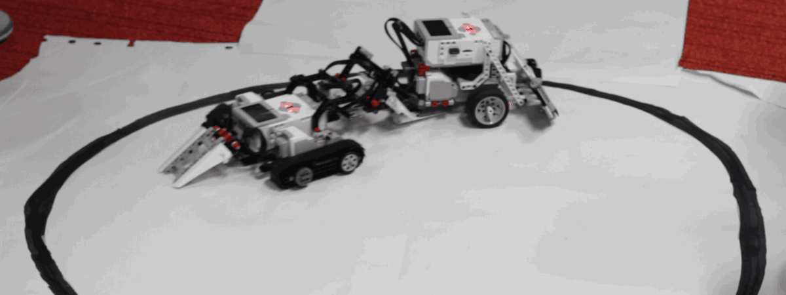

# Zühlke RoboChallenge
This is the official repository for the Zühlke RoboChallenge.
You can find more information about the event and registration (students only) on our homepage. 

- 4/5. Nov 2016, Bern (Switzerland), https://www.zuehlke.com/ch/de/robochallenge/ (Information is only avaible in German)

## The Challenge

You find detailed information regarding the challenge [here](challenges/sumo.md).

## Quickstart

To get started using Lego Mindstorms and ev3dev (http://www.ev3dev.org), please read
[quickstart.md](quickstart.md).

## Frameworks

We created several example programs for the different programming languages:

* see [framework](framework)

