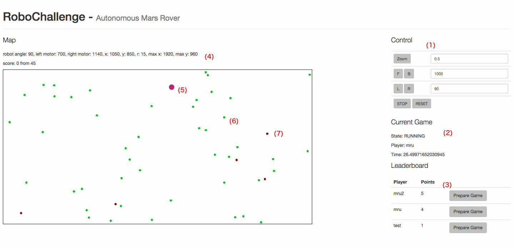
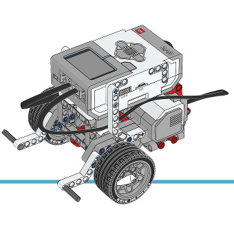

# RoboChallenge - Autonomous Mars Rover

Welcome to this year’s Zühlke RoboChallenge. Our fictional Zühlke Space  program is in beta phase for humanity’s population of Mars. Our Mars Rover (Lego Mindstorms Robot) has already landed. Unfortunately the last supply ship has crashed and all the supplies are scattered around on Mars. Your mission, should you choose to accept it, is to program an algorithm to collect all the supplies. Every collected item gives you points. But be careful, there are craters all around! Should you drive into a crater you will lose some of your already collected items.

You are free to choose your preferred programming language. The message format is JSON and all the communication is asynchronous over the MQTT protocol. Besides the location of craters and items, you will receive the coordinates of the robot and the current state (gyro sensor, left motor and right motor) as well.
 
We also provide you with a simulator which you can use to test your algorithm. When you feel ready you can register for a slot with the real Rover and see if you can collect the most supplies in the available time. 
The algorithm which collects the most supplies with the best time wins a prize.

It’s your chance to try different approaches and see which algorithm will do best in a real-world setting. Simple algorithm or a sophisticated machine learning approach. It’s up to you.


### Get started
First install [Docker](https://www.docker.com/) and checkout this repository. Docker is used to start the simulator and web interface.

__Note:__ Windows try docker-toolbox https://www.docker.com/products/docker-toolbox

### Interface for Players
Have a look at the [Interface for Players](player-interface.md) documentation for a detailed overview about all the messages and communication to start the Mars Rover mission.

### Simulator
After you have installed Docker you can build and start the simulator. First lets build the simulator with _'docker-compose build'_.

```bash
docker-compose -f docker-compose-simulator.yml build
```

After the simulator was build we can start the simulator with _'docker-compose up'_. The simulator will start the mqtt broker (broker), 
the position and robot simulator, the gamemaster (leaderbord and score) and web ui.


```bash
docker-compose -f docker-compose-simulator.yml up
```

Now the simulator is stared you can connect to the web interface.

```bash
http://localhost:8080
```

You should see the web interface and when you start a new game you should see something like this.

1. __Control__: with this panel you can control the robot. 
2. __Current Game__: This panel shows all details about the current game (time, player, etc).
3. __Leaderboard__: Here you can start a game for a registered player and see the score for all players. 
4. __Map__: This panel shows all sensor data from the world.
5. The Mars Rover.
6. A supply item.
7. A crater.





Next try to start a game and play around with the web interface to control the Mars Rover. Then you could have a look at the examples how to control the Mars Rover with a programming language.
- [Examples](examples)


### Mars Rover
The Mars Rover is a LEGO Mindstorms robot with a Gyro sensor and two motors.

- Right motor (EV3 large motor) -> Output pin A
- Left motor (EV3 large motor) -> Output pin B




### Positional System
The real Positional System is a webcam which can detect the Lego Mindstorms Robot.